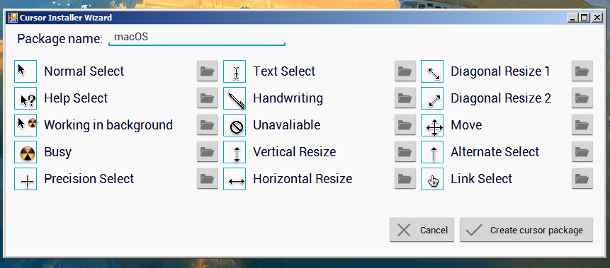
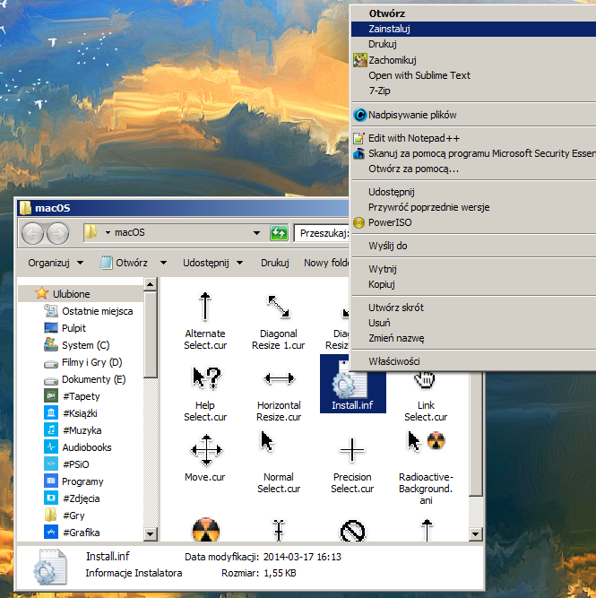

# windows-mouse-cursor-installer-wizard
Forked from https://archive.codeplex.com/?p=cursorinstaller

"Cursor Installer Wizard" is simple application that create installation package for cursors. 

With this application you don't have to configure each cursor separately. Just create package and install your favorite cursor with two clicks.

# Installation / Download Process
1. Go to [Releases](https://github.com/iamtalhaasghar/windows-mouse-cursor-installer-wizard/releases) page.
2. Download `CursorInstallerWizard_1.0.zip` and Extract this zip file.
3. Then run `CursorInstallerWizard.exe`

# How to Create Your Icons

   1. Type in name of your cursor package and select your cursors than click "Create cursor package"   

   2. Application will create zip file with your cursors and install file (Install.inf)  

   3. Right click on Install.inf and select Install, system will copy your cursors to windows directory. Now you can find your cursor theme in mouse pointer configuration.  

